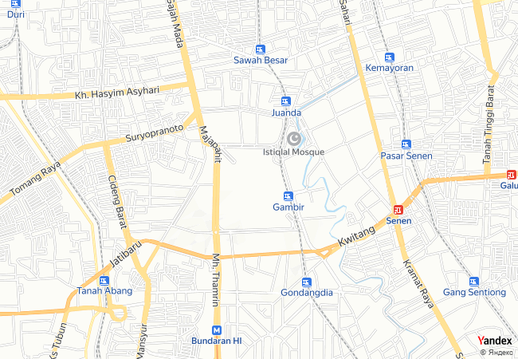

# Telegram bot Gucotomap

A simple game of guessing places on the map through a telegram bot
Gucotomomap is basically an acronym for "Guess the country by the town on the map."

You can play it right now by clicking on the following link https://t.me/gucotomap_bot


# Technologies

- Python 3.10
    - aiogram - library for developing telegram bots
    - pymongo - Library for storing user data in MongoDB


# General info
This project is a telegram bot that offers to play a game where you have to guess which country the city shown on the map belongs to. Static API map from Yandex is used to create maps. I attach a link to its documentation [link](https://yandex.ru/dev/staticapi/doc/en/quickstart). Using aiogram library we develop our telegram bot. Here is the [link](https://aiogram.dev) of its. Also, I use cloud MongoDB to storage user data [link](https://cloud.mongodb.com).


## API Reference

### Sample API-request
```
https://static-maps.yandex.ru/v1?ll=37.620070,55.753630&size=450,450&z=13&pt=37.620070,55.753630,pmwtm1~37.64,55.76363,pmwtm99&apikey=YOUR_API_KEY
```
Sample of API-request's result




## Bot logic

- bot.py - binds all the components and launches the bot
- workers
    - map_worker.py - works with api-map, and represent main thing in this game - creating a map image and providing response options.
    - menu.py - sets menu option (/start, /help, etc)
    - database.py - simplifies work with user data from cloud MongoDB
    - logset.py - creates logs of the bot's work. There are logging options in .env.example file
- map_data - stores json format file, where a city is represented like dictionary. For example:
```
"Tokyo": {
        "latitude": 35.6897,
        "longtitude": 139.6922,
        "country": "Japan",
        "capital": "Tōkyō",
        "population": 37732000.0
    }
```
- keyboards
    - menu_keyboards.py - stores buttons type of InlineKeyboard, ReplyKeyboard, that used, where our user is in the main menu.
    - user_keyboards.py - stores the same, but they are used, when the user in the game process.
- handlers
    - admin_handlers.py - aiogram handlers, that are available to admin users (they are known in .env)
    - command_handlers.py - handlers for commands starting with '/'
    - menu_handlers.py - main handlers, that are used to navigate through the menu
    - user_handlers.py - handlers, that are used while the user is in the game.
    - pass_handlers.py - a stub that responds with an explanation of the absence of such a command.
- config_data
  -  config.py - stores class Config, that stores all the received data from .env file.
- access_filters
  - tg_filter.py - stores filters for handlers.


## Feedback

I would be be thankful for any criticism and suggestions about this project.

kshabalin11@yandex.ru

https://t.me/eklipsan