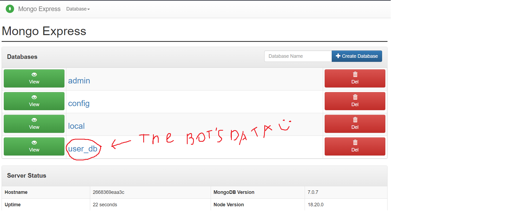

# Telegram bot Gucotomap

A simple game of guessing places on the map through a telegram bot
Gucotomomap is basically an acronym for "Guess the country by the town on the map."

You can play it right now by clicking on the following link https://t.me/gucotomap_bot


# Technologies

- Python 3.10
    - aiogram - library for developing telegram bots
    - pymongo - Library for storing user data in MongoDB
- Docker - used for fast bot deployment


# General info
This project is a telegram bot that offers to play a game where you have to guess which country the city shown on the map belongs to. Static API map from Yandex is used to create maps. I attach a link to its documentation [link](https://yandex.ru/dev/staticapi/doc/en/quickstart). Using aiogram library we develop our telegram bot. Here is the [link](https://aiogram.dev) of its. Also, I use cloud MongoDB to storage user data [link](https://cloud.mongodb.com).


## API Reference

### Sample API-request
```
https://static-maps.yandex.ru/v1?ll=37.620070,55.753630&size=450,450&z=13&pt=37.620070,55.753630,pmwtm1~37.64,55.76363,pmwtm99&apikey=YOUR_API_KEY
```
Sample of API-request's result


## Bot logic

- bot.py - binds all the components and launches the bot
- workers
    - map_worker.py - works with api-map, and represent main thing in this game - creating a map image and providing response options.
    - menu.py - sets menu option (/start, /help, etc)
    - database.py - simplifies work with user data from cloud MongoDB
    - docker_database.py - the same database.py, but for docker deployment.
    - logset.py - creates logs of the bot's work. There are logging options in .env.example file
- map_data - stores json format file, where a city is represented like dictionary. For example:
```json
"Tokyo": {
        "latitude": 35.6897,
        "longtitude": 139.6922,
        "country": "Japan",
        "capital": "Tōkyō",
        "population": 37732000.0
    }
```
- keyboards
    - menu_keyboards.py - stores buttons type of InlineKeyboard, ReplyKeyboard, that used, where our user is in the main menu.
    - user_keyboards.py - stores the same, but they are used, when the user in the game process.
    - parameter_keyboards.py - stores buttons, that are used to set the game parameters.
- handlers
    - admin_handlers.py - aiogram handlers, that are available to admin users (they are known in .env)
    - command_handlers.py - handlers for commands starting with '/'
    - menu_handlers.py - main handlers, that are used to navigate through the menu
    - user_handlers.py - handlers, that are used while the user is in the game.
    - pass_handlers.py - a stub that responds with an explanation of the absence of such a command.
- config_data
  -  config.py - stores class Config, that stores all the received data from .env file.
- access_filters
  - tg_filter.py - stores filters for handlers.

## Deployment Instruction

## Method 1. Docker compose
To deploy the Gucotomap bot, follow these steps:
### 1. Clone the repository

First, clone the repository to the local machine or server where you intend to run the bot.

```bash
git clone https://github.com/eklipsan/Gucotomap_bot
cd Gucotomap_bot
```
### 2. Open the docker-compose.yaml file and configure the environment variables

In the docker-compose.yaml file, you can configure the environment variables that will be used when the container starts. What you should definitely change is the ``BOT_TOKEN`` variable, which is responsible for your bot's token. The rest of the variables can be left as default.

### 3. Run the docker compose up command
Now it remains to run the command
```bash
 docker compose up
```
1. After entering the command, the MongoDB container will be started, which is responsible for storing user data (this data will be stored in the Gucotomap_data volume).
2. You will also be able to monitor MongoDB through the web interface at [localhost:8081](localhost:8081), where you need to enter login: admin, password: pass



1. And now you can go to your bot, whose token you entered in docker-compose.yaml, and click /start, which will start the bot!


## Method 2. Manual installation and configuration

To deploy the Gucotomap bot this way, follow these steps:

Translated with DeepL.com (free version)
To deploy the Gucotomap Telegram Bot, follow these steps:

### 1. Clone the Repository

First, clone the repository to your local machine or server where you intend to run the bot.

```bash
git clone https://github.com/eklipsan/Gucotomap_bot
cd Gucotomap_bot
```
### 2. Set Up a Virtual Environment

It's recommended to use a virtual environment for Python projects. You can set one up using:
```bash
python3 -m venv venv
source venv/bin/activate
```


### 3. Install Dependencies

Install the required Python packages listed in `requirements.txt`:

```bash
pip install -r requirements.txt
```


### 4. Configure Environment Variables

Copy the `.env.example` file in the root directory of the project to a new file called `.env`. You'll need to set the following environment variables:

- `BOT_TOKEN`: Your Telegram Bot Token from BotFather.
- `ADMIN_IDS`: A list of Telegram user IDs that will have admin privileges.
- `MONGODB_NAME`: Your MongoDB username.
- `MONGODB_PASSWORD`: Your MongoDB password.
- `MONGODB_CLUSTER`: Your MongoDB cluster address.
- `API_KEY_MAP`: Your Yandex Static Map API key. (You may not replace this variable with your own, because env.example's variable is working)


### 5. Run the Bot

With the environment configured, you can start the bot using:

```bash
python3 bot.py
```


The bot should now be running and able to respond to commands sent on Telegram.

### 6. (Optional) Configure Logging

You can adjust logging settings in the `.env` file to enable or disable console and file logging, specify the log file path, and set the logging level.

## Feedback

I would be be thankful for any criticism and suggestions about this project.

kshabalin11@yandex.ru

https://t.me/eklipsan