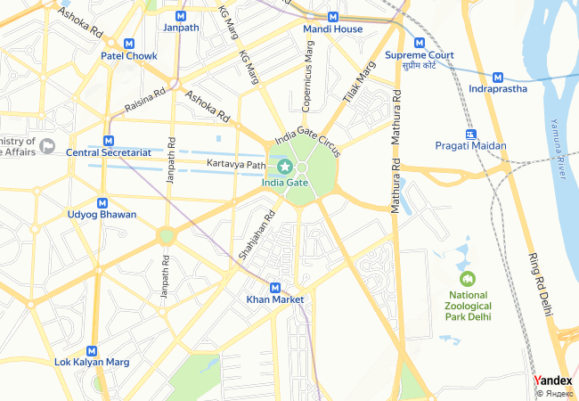
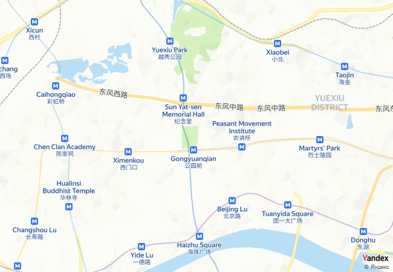

# Телеграм-бот Gucotomap

Простая игра по угадыванию мест на карте с помощью телеграм-бота
Gucotomomap - это по сути аббревиатура от "Guess the country by the town on the map"

Вы можете поиграть в нее прямо сейчас, перейдя по следующей ссылке https://t.me/gucotomap_bot


# Технологии

- Python 3.10
    - aiogram - библиотека для разработки ботов Telegram
    - pymongo - библиотека для хранения пользовательских данных в MongoDB


# Общая информация
Этот проект представляет собой telegram-бота, который предлагает сыграть в игру, где нужно угадать, к какой стране относится город, изображенный на карте. Для создания карт используется Static API map от Яндекса. Прилагаю ссылку на документацию к ней [ссылка](https://yandex.ru/dev/staticapi/doc/en/quickstart). Используя библиотеку aiogram, мы разрабатываем нашего telegram-бота. Вот ссылка [ссылка](https://aiogram.dev) на нее. Также я использую облачную MongoDB для хранения пользовательских данных [ссылка](https://cloud.mongodb.com).


## API Reference

### Пример API-запроса
```
https://static-maps.yandex.ru/v1?ll=37.620070,55.753630&size=450,450&z=13&pt=37.620070,55.753630,pmwtm1~37.64,55.76363,pmwtm99&apikey=YOUR_API_KEY
```
Образец результата API-запроса



## Логика работы бота

- bot.py - связывает все компоненты и запускает бота
- workers
    - map_worker.py - работает с api-map, и представляет собой главное в этой игре - создание изображения карты и предоставление вариантов ответа.
    - menu.py - устанавливает опции меню (/start, /help и т.д.)
    - database.py - упрощает работу с пользовательскими данными из облачной MongoDB
    - logset.py - производит логирование работы бота. Логирование можно настроить через .env файл
- map_data - хранит файл формата json, в котором город представлен как словарь. Например:
```json
"Tokyo": {
        "широта": 35.6897,
        "longtitude": 139.6922,
        "страна": "Япония",
        "столица": "Токио",
        "население": 37732000.0
    }
```
- keyboards
    - menu_keyboards.py - хранит кнопки типа InlineKeyboard, ReplyKeyboard, которые используются, когда наш пользователь находится в главном меню.
    - user_keyboards.py - хранит то же самое, но они используются, когда пользователь находится в игровом процессе.
- handlers
    - admin_handlers.py - обработчики аиограмм, которые доступны пользователям-администраторам (они находятся в .env)
    - command_handlers.py - обработчки команд, которые начинаются с '/'
    - menu_handlers.py - основные обработчики, которые используются для навигации по меню
    - user_handlers.py - обработчики, которые используются, когда пользователь находится в игре.
    - pass_handlers.py - заглушка, отвечающая объяснением отсутствия такой команды.
- config_data
  - config.py - хранит класс Config, в котором хранятся все полученные данные из файла .env.
- фильтры доступа
  - tg_filter.py - хранит фильтры для обработчиков.


## Обратная связь

Я буду благодарен за любую критику и предложения по этому проекту.

kshabalin11@yandex.ru

https://t.me/eklipsan